# Asian Delight Restaurant - Team 14
Our Project is creating a website for a conceptual restaurent called, Asian Delight Restaurant. This website is mainly focusing on providing an interesrt for the people who are loving to enjoy the Asian taste.  
This website is being built using couple of web development related client side and server side scripting laguages and design methodologies like, HTML,CSS,javaScript,Bootstap,php & mysql.

## Table of Contents

* [Features](##Features)

* [Database Tables](##DatabaseTable)

* [Created Forms](##CreatedForms)

* [Created Tables](##CreatedTables)

## Features
In this section, list and describe the features or functionality that you are working on. You can use checkboxes to track the progress of each feature.

 Feature 1 (Yashodha Amarasinghe): Creating admin panel to Managing food categories and food item details. 
 Feature 2 (Yashodha Amarasinghe): Retrive and manage orders from the adming panel. 
 Feature 3 (Yashodha Amarasinghe): Handling restaurant menu items dynamicaly. 
 Feature 4 (Mayuri Yashodha): Handling member resistration and member details Update/Delete. 
 Feature 5 (Udashi Jayaneththi): Handling services and booking events. 
 Feature 6 (Kapila Bandara): Handling customer feedbacks and ratings. 
 Feature 7 (Mayuri Yashodha): Handling Table reservation. 
 Feature 8 (Member Name): Online Order function including the shopping cart. 
 Feature 9 (Member name): Handling offer and services according to the user levels(member/non-member). 
 Feature 10 (Member name): Handling Login function with different user levels. 
 
### Feature 1
#### 1. Creating admin panel to Managing food categories and food item details :
In this feature created the admin panel with .htaccess and added forms to insert food categories and retriew existing food categories. And added form to insert food item details and then retriew the inserted item details and allowed the admin user to do the updation and deletion of the food items. 

Github link(Admin Panel) : https://github.com/Yashodha8890/Web_Programming_Project/blob/main/admin/admin.php , shell.hamk.fi link: http://shell.hamk.fi/~yashodha23000/Web_Programming_Project/admin/admin.php  

GitHub link(Add & retriew catergories and add food items) : https://github.com/Yashodha8890/Web_Programming_Project/blob/main/admin/add_categories_and_item.php , shell.hamk.fi link: http://shell.hamk.fi/~yashodha23000/Web_Programming_Project/admin/add_categories_and_item.php  

GitHub link(Retriew food Items) : https://github.com/Yashodha8890/Web_Programming_Project/blob/main/admin/manage_food_items.php , shell.hamk.fi link: http://shell.hamk.fi/~yashodha23000/Web_Programming_Project/admin/manage_food_items.php 

GitHub link(Manage(Update/Delete) food Items) : https://github.com/Yashodha8890/Web_Programming_Project/blob/main/admin/update_food_items.php , shell.hamk.fi link: http://shell.hamk.fi/~yashodha23000/Web_Programming_Project/admin/update_food_items.php?itemId=1  

Github link(.htaccess) : https://github.com/Yashodha8890/Web_Programming_Project/blob/main/admin/.htaccess  
Github link(.htpasswd) : https://github.com/Yashodha8890/Web_Programming_Project/blob/main/admin/.htpasswd  
 
 
### Feature 2

#### 2. Retrive and manage orders from the adming panel :
In this feature, added a table for retriewing order details from the database and display existing order details and from that table and has been provided the facility for the admin user to click on update or delete and the required details by navigating to a details page. 

GitHub link(Retriew food orders) : https://github.com/Yashodha8890/Web_Programming_Project/blob/main/admin/food_orders.php , shell.hamk.fi link: http://shell.hamk.fi/~yashodha23000/Web_Programming_Project/admin/food_orders.php 

GitHub link(Manage(Update/Delete) food orders) : https://github.com/Yashodha8890/Web_Programming_Project/blob/main/admin/manage_orders.php , shell.hamk.fi link: http://shell.hamk.fi/~yashodha23000/Web_Programming_Project/admin/manage_orders.php?orderNo=1 

From the website users can view dynamic menu items where the data is retiewing from the database table which is insered by the admin.

### Feature 3

#### 3. Handling restaurant menu items dynamicaly :
With this feature website users can able to see the dynamic menu items in the restaurant menu. All the inserted menu items from the admin panel is being loaded in the Menu dynamically. If the admin user has updated any details of a food item or delete any, that will be indicated in the restaurant menu by retriewing data from the database.

GitHub link(Retriew Menu Items - From Line number 165-208 ) : https://github.com/Yashodha8890/Web_Programming_Project/blob/main/index.php , shell.hamk.fi link: http://shell.hamk.fi/~yashodha23000/Web_Programming_Project/index.php#menu 

### Feature 4

#### 4. Handling member resistration and member details Update/Delete : 
Handling member resistration & login with different user levels :  
In the registration feature, the website will allow users to register with Asian delight restaurant. A member ID is created for each registered user. A registered member can do other functions after logged into the account. By doing this, it is easy to administrators to manage user accounts and previlages.
  Provide links to related code files (github) & link to the feature (shell.hamk.fi) .

### Feature 5
#### 5. Handling services and booking events :  
With the feature of services and event booking, website users can book their private events and access services through the website. When booking private events or accessing services, users are required to become members of the website first. If they are not members they will direct to registration form.  
 Provide links to related code files (github) & link to the feature (shell.hamk.fi) .
GitHub link(customer booking event) :https://github.com/Yashodha8890/Web_Programming_Project/blob/main/event_booking.php, shell.hamk.fi link: http://shell.hamk.fi/~jayaneththi23000/project/event_booking.php  

GitHub link (Customer booking edit page by customer): https://github.com/Yashodha8890/Web_Programming_Project/blob/main/event_process.php ,shell.hamk.fi :http://shell.hamk.fi/~jayaneththi23000/project/event_process.php
 

GitHub link(customer booking event/ update and delete): https://github.com/Yashodha8890/Web_Programming_Project/blob/main/manage_event.php , shell.hamk.fi link: http://shell.hamk.fi/~jayaneththi23000/project/manage_event.php?event_id=103
 
GitHub link(Admin booking event) :https://github.com/Yashodha8890/Web_Programming_Project/blob/main/admin/admin_events.php , Shell.hamk.fi : http://shell.hamk.fi/~jayaneththi23000/project/admin/admin_events.php
 
GitHub link(Admin booking event update/delete): https://github.com/Yashodha8890/Web_Programming_Project/blob/main/admin/admin_update_event.php , shell.hamk.fi link: http://shell.hamk.fi/~jayaneththi23000/project/admin/admin_update_event.php?event_id=99

  
GitHub link(Customer delivery oder): https://github.com/Yashodha8890/Web_Programming_Project/blob/main/delivery.php , shell.hamk.fi link: http://shell.hamk.fi/~jayaneththi23000/project/delivery.php
 
  
 GitHub link ( Admin delivery oder): https://github.com/Yashodha8890/Web_Programming_Project/blob/main/admin/admin_delivery.php , Shell.hamk.fi link: http://shell.hamk.fi/~jayaneththi23000/project/admin/admin_delivery.php

 GitHub link (Admin delivery oders update/delete):

### Feature 6

#### 6. Handling customer feedbacks and ratings :  
In this feature, Collecting customer's Messages(Feedbacks),Complaints and reviews. If the user is not a registered member refer to the register form.The admin can view,update and delete customers feedback. 
 Provide links to related code files (github) & link to the feature (shell.hamk.fi) .

### Feature 7

#### 7. Handling Table reservation :

### Feature 8

#### 8. Online Order function including the shopping cart :
With the Order Online feature, Asian Delight Restaurant users can order their food through the website. If the user is not a member, then he or she will be directing to Member Registration while members can log in to the website and add their items to the shopping cart. Once they are done with their selection they can do checkout and print the order as PDF. If the user wants to remove any added item from the cart he/she can remove them before performing the checkout.  
Not completed.
 Provide links to related code files (github) & link to the feature (shell.hamk.fi). 

### Feature 9

#### 9. Handling offer and services according to the user levels(member/non-member). 
Provide links to related code files (github) & link to the feature (shell.hamk.fi). 

### Feature 10

#### 10. Handling Login function with different user levels. 
Provide links to related code files (github) & link to the feature (shell.hamk.fi). 

## Database Tables
List the database tables that are part of your project.

Table 1 (Yashodha Amarasinghe): food_categories 
Table 2 (Yashodha Amarasinghe): food_items 
Table 3 (Yashodha Amarasinghe): oder_details 
Table 4 (Mayuri Yashodha): user_registration 
Table 5 (Mayuri Yashodha): table_reservation 
Table 6 (udashi Jayaneththi): events_booking 
Table 7 (udashi Jayaneththi): delivery 
Table 8 (Kapila Bandara): customer_feedback 
Table 9 (Kapila Bandara): restaurant_rating 

Include the ER Diagram of the database.  
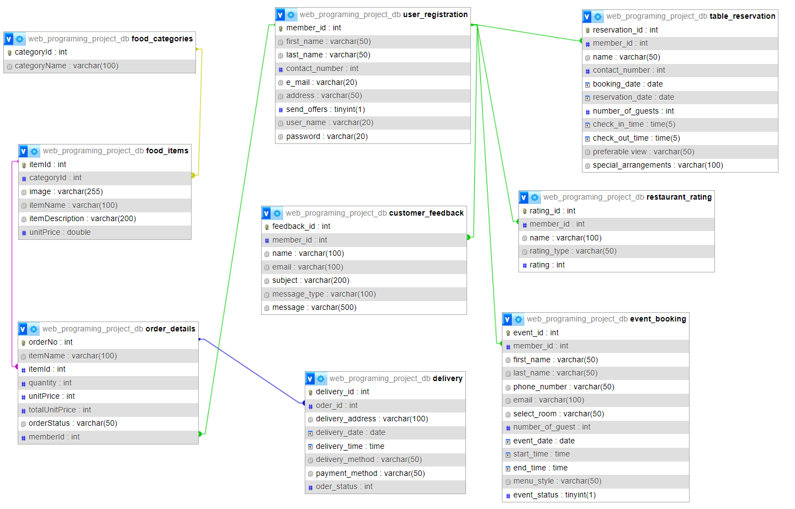  

## Created Forms
List and describe any forms that have been created as part of your project. Include details about the purpose of each form and any validation logic.

Form 1: (Yashodha Amarasinghe): Add food Categories and items: [Link to the related code file](https://github.com/Yashodha8890/Web_Programming_Project/blob/main/admin/add_categories_and_item.php) (github) | [Link to the form](http://localhost:81/Web_Programming_Project/admin/add_categories_and_item.php) (shell.hamk.fi). | Validations Applied 
In this page there are two forms created, one form is used to insert food categories(Sri Lankan/Indian/Malaysian etc..) to the database food_categories table. while other form is used to insert food items to the database food_items table. Food items will be mapped with the food category. Cannot be inserted any item without selecting a food category due to the foriegn key constraints.  
Validations :  
1. HTML validations for required data in the add food items form (Item Name/Item Category/Unit price - required, item name/Item Description - minlength & maxlength) 
2. JavaScript event listner validation for Item Name and Unit price. Item name should have number of characters between 3 and 100, Unit price should not be a minus(-) value.  
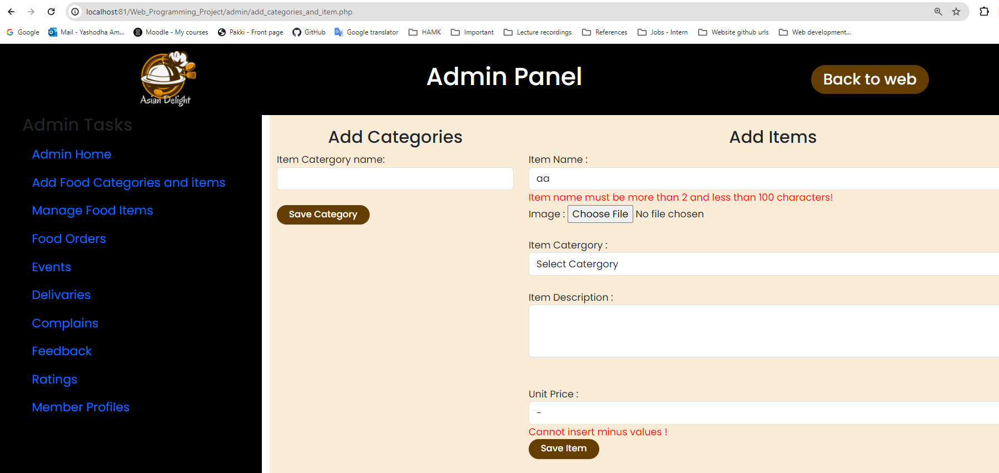  

Form 2: (Yashodha Amarasinghe): Update Food items: [Link to the related code file](https://github.com/Yashodha8890/Web_Programming_Project/blob/main/admin/update_food_items.php) (github) | [Link to the form](http://shell.hamk.fi/~yashodha23000/Web_Programming_Project/admin/update_food_items.php?itemId=1) (shell.hamk.fi). | Validations Applied 
Validations :  
1. HTML validations for required data in the update food items form (Item_Id/Category_Id - Disabled editing, Item Name/Item Category/Unit price - required, item name/Item Description - minlength & maxlength) 
2. JavaScript event listner validation for Item Name and Unit price. Item name should have number of characters between 3 and 100, Unit price should not be a minus(-) value.  
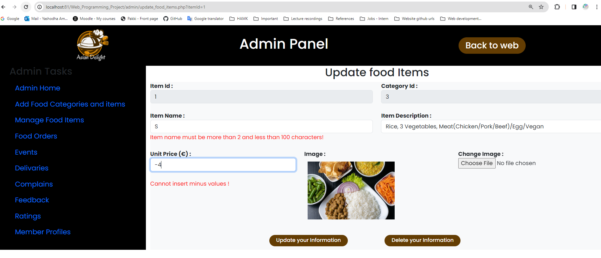  

Form 3: (Yashodha Amarasinghe): Update order details : [Link to the related code file](https://github.com/Yashodha8890/Web_Programming_Project/blob/main/admin/manage_orders.php) (github) | [Link to the form](http://shell.hamk.fi/~yashodha23000/Web_Programming_Project/admin/manage_orders.php?orderNo=1) (shell.hamk.fi). | Validations Applied 
Validations :  
1. HTML validations for required data in the update order details form (Item Name/Item Category/Unit price - required, Item_Id/Category_Id/member_id - Disabled editing, Description - minlength & maxlength) 
2. JavaScript event listner validation for Quantity, Unit price, total price and order status. Quantity should not be empty or minus or 0, Unit price/Total Price should not be a minus(-) value, Order Status cannot be empty.  
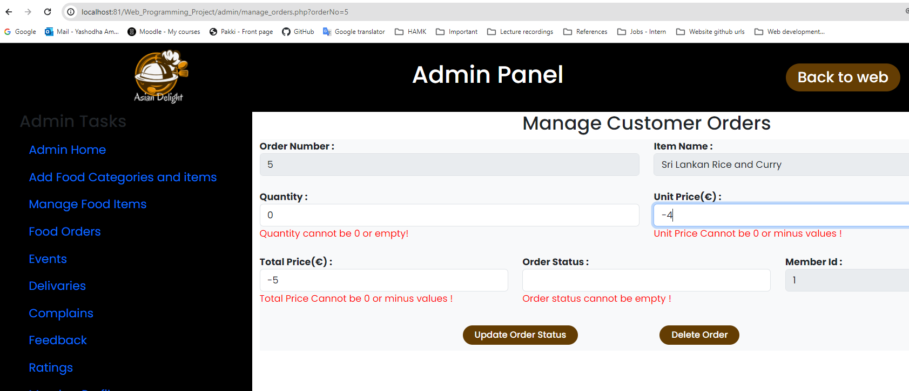  

 
Form 4: (Udashi Jayaneththi): Customer Event Booking: https://github.com/Yashodha8890/Web_Programming_Project/blob/main/event_booking.php (github) | http://shell.hamk.fi/~jayaneththi23000/project/event_booking.php (shell.hamk.fi). | Validations Applied 

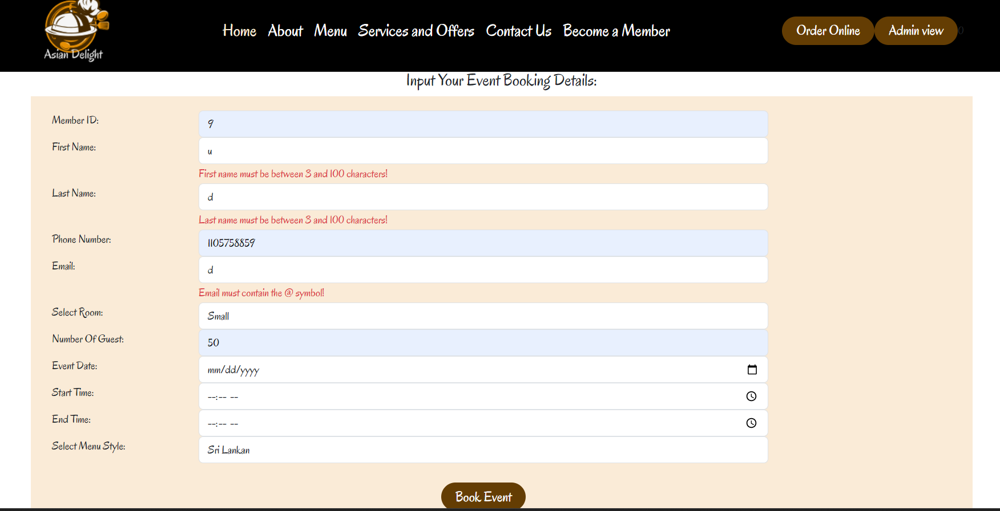 

Form 5: (Udashi Jayaneththi): Customer event update and delete: https://github.com/Yashodha8890/Web_Programming_Project/blob/main/manage_event.php (github) | http://shell.hamk.fi/~jayaneththi23000/project/manage_event.php?event_id=104 (shell.hamk.fi). | Validations Applied 
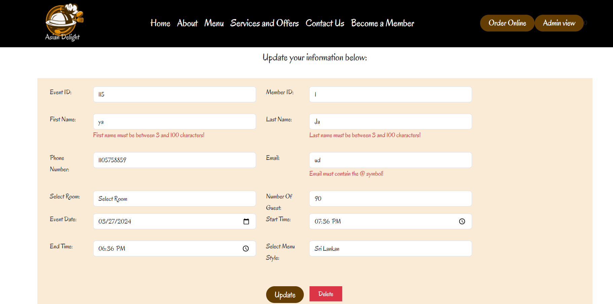 

Form 6: (Udashi Jayaneththi): Admin event booking update and delete: https://github.com/Yashodha8890/Web_Programming_Project/blob/main/admin/admin_update_event.php (github) | http://shell.hamk.fi/~jayaneththi23000/project/admin/admin_update_event.php?event_id=99 (shell.hamk.fi). | Validations Applied  
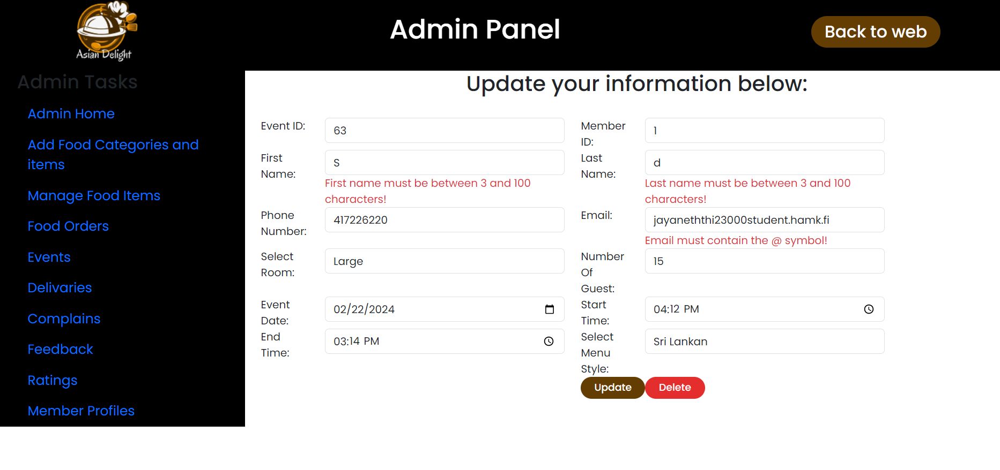 

Form 7: (Udashi Jayaneththi): Delivery Odres: https://github.com/Yashodha8890/Web_Programming_Project/blob/main/delivery.php (github) | http://shell.hamk.fi/~jayaneththi23000/project/delivery.php (shell.hamk.fi). | Validations Applied 
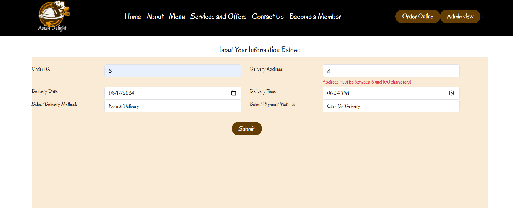 

Form 8: (Udashi Jayaneththi): Admin delivery oders update and delete: https://github.com/Yashodha8890/Web_Programming_Project/blob/main/admin/admin_delivery_update.php (github) | http://shell.hamk.fi/~jayaneththi23000/project/admin/admin_delivery.php (shell.hamk.fi). |  
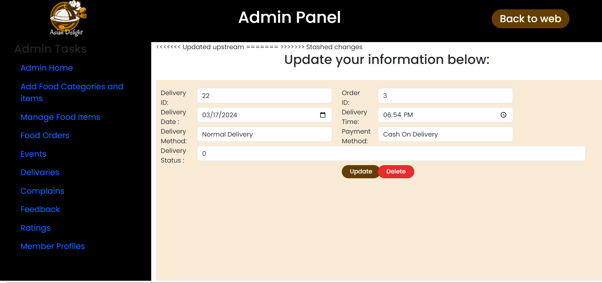 

Form 4: (Created By): Form Name: Link to the related code file (github) | Link to the form (shell.hamk.fi). | Validations Applied 

## Created Tables
List any tables that you have created in the project work 
eg : 
Table 1 (name): table_name | Link to the related code file (github) | Link to the table (shell.hamk.fi).  

Table 1 (Yashodha Amarasinghe): food_categories [Link to the related code file](https://github.com/Yashodha8890/Web_Programming_Project/blob/main/admin/add_categories_and_item.php) (github) | [Link to the table](http://shell.hamk.fi/~yashodha23000/Web_Programming_Project/admin/add_categories_and_item.php) (shell.hamk.fi).  
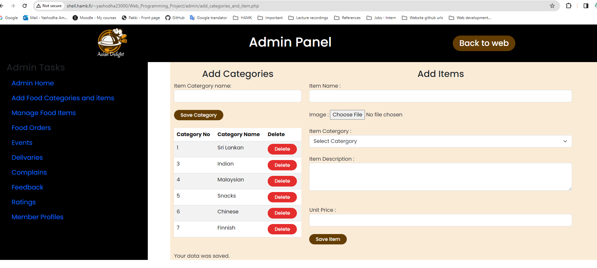  
 Database table : food_categories   
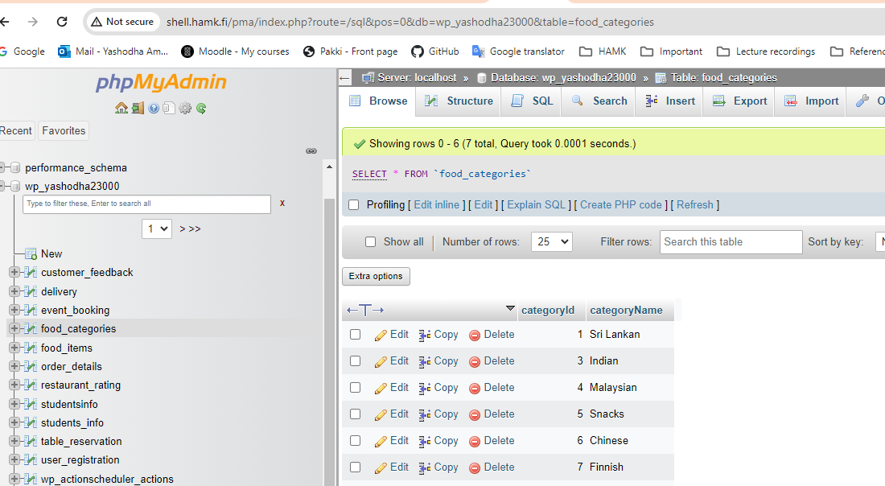  

Table 2 (Yashodha Amarasinghe): food_items [Link to the related code file](https://github.com/Yashodha8890/Web_Programming_Project/blob/main/admin/manage_food_items.php) (github) | [Link to the table](http://shell.hamk.fi/~yashodha23000/Web_Programming_Project/admin/manage_food_items.php) (shell.hamk.fi).  
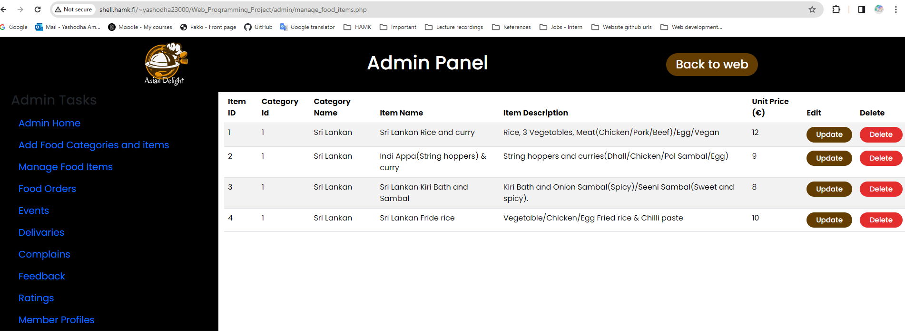  
 Database table : food_items  
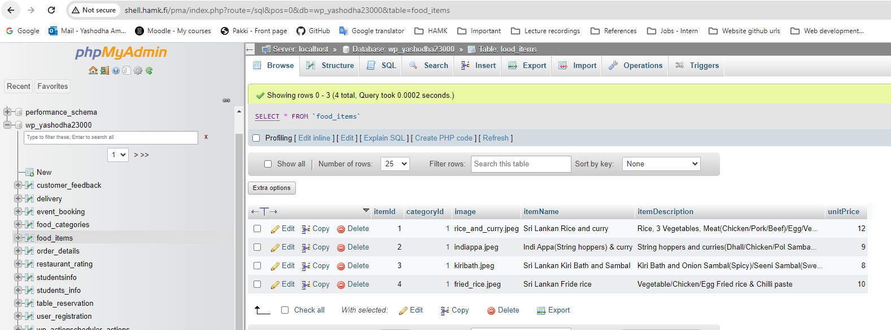  

Table 3 (Yashodha Amarasinghe): oder_details [Link to the related code file](https://github.com/Yashodha8890/Web_Programming_Project/blob/main/admin/food_orders.php) (github) | [Link to the table](http://shell.hamk.fi/~yashodha23000/Web_Programming_Project/admin/food_orders.php) (shell.hamk.fi).  
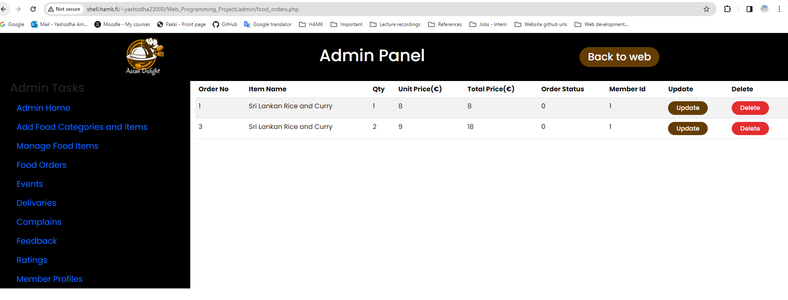  
 Database table : order_details  
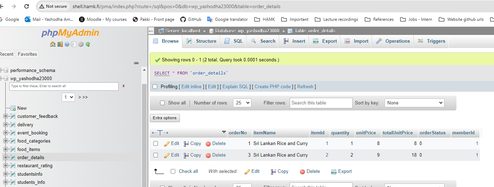  

Table 4 (Mayuri Yashodha): Registration_form Link to the related code file (github) | Link to the table (shell.hamk.fi).  
Table 5 (Mayuri Yashodha): table_reservation Link to the related code file (github) | Link to the table (shell.hamk.fi).  
Table 6 (udashi Jayaneththi): events_booking Link to the related code file (github) | Link to the table (shell.hamk.fi).  

Table 7 (udashi Jayaneththi): delivery Link to the related code file (github) | Link to the table (shell.hamk.fi).  
Table 8 (Kapila Bandara): customer_feedback Link to the related code file (github) | Link to the table (shell.hamk.fi).  
Table 9 (Kapila Bandara): restaurant_rating Link to the related code file (github) | Link to the table (shell.hamk.fi).  

